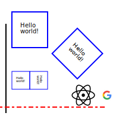

# Writing SVG images

<!-- written by copilot -->

SVG is a vector graphics format that can be used to create images that scale to any size without loss of quality. It is a markup language, similar to HTML, that can be written in a text editor. SVG images can be embedded in HTML pages, or they can be saved as standalone files.

SVG images can be created in a number of ways. The simplest way is to use a drawing program that can export SVG files. Inkscape is a free, open source program that can be used to create SVG images. It can be downloaded from [inkscape.org](https://inkscape.org/).

## Creating an SVG image in Inkscape

::: todo
 tutorial on creating an SVG image in Inkscape
:::

## Embedding an SVG image in an HTML page

If you are writing an HTML or Markdown page, you can embed an SVG image using the `` tag. The `src` attribute of the tag should be the path to the SVG file. The `alt` attribute should be a short description of the image.

```html

```

<!---You can also use the `<object>` tag to embed an SVG image. The `data` attribute should be the path to the SVG file. The `type` attribute should be `image/svg+xml`.

```html -->

You can also write SVG directly inside the HTML/Markdown file:
```html
<svg width="100" height="100">
  <circle cx="50" cy="50" r="40" stroke="green" stroke-width="4" fill="yellow" />
</svg>
```

## Writing a standalone SVG file by hand

::: todo
 tutorial on writing a standalone SVG file by hand
:::

## Writing a standalone SVG file using Javascript

See [this example](./example.svg.mjs)

<pre class="scroll" style='max-height:30em;'><code class="language-js" lc-code-src="./example.svg.mjs">
Example code goes here
</code></pre>

And then you can use the output:
```md

```
#[The output result "[example.svg](./example.svg)"](./example.svg)
::: todo
parsing inside figure caption, also use a better syntax such as:
```
#id[alt](src)[
  caption (multiline/block)
]
```
:::

#[aasaasa](./VSCode_example.png)