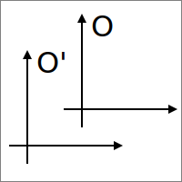
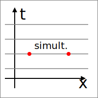
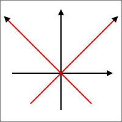

!!newcommand{!!spr}{Special Relativity}
!!newcommand{!!relp}{Relativity Principle}
!!newcommand{!!sdr}{S.D.R.}
!!newcommand{!!refsys}{Reference System}
!!newcommand{!!irs}{I.R.S.}
!!newcommand{!!covform}{covariant formulation}
!!newcommand{!!galrel}{Galilean Relativity}

<!--::: warning
the fucking language
:::-->

# Introduction

We will start by building a _Lagrangian Formulation_ for _Electrodynamics_, i.e. a field theory. We will not study the Hamiltonian formulation that is more complicated.

The **!!spr** theory, is composed of two concepts:
- the **!!relp**: states the existence of *Inertial Reference Systems* (!!irs)
- the existence of the **speed of light** that is _the same in every !!sdr{}_
<!-- TODO remove the final dot or {} or introduce a notation for NULL token, for exmaple {} -->

<!-- ! the `#[a](./o_o1st.svg)` syntax stopped working, make it work again!!! -->
<figure class="float-right max-width-25">
    
    <figcaption>Figure 1: a</figcaption>
</figure>
<!-- TODO add W vector -->

The !!relp states the existence of a _class of !!sdr{}s_ in which the laws of physics are the same (i.e. the laws af physics are written in a !!covform) that are connected by a linear transformation that in the form: "translation + const. speed offset"

::: note
The *!!galrel* requires only the !!relp but not the light speed invariance.
:::

## Reference system

::: def
A **!!refsys** is a map that associates eache point of the space-time $\mathcal{M}$ a point in $\mathbb{R}^4$:
$$
\mathcal{M} \longrightarrow \mathbb{R}^4
$$
Elements of $\mathcal{M}$ are said **Event**s.
:::

<figure class="float-right max-width-30">
    
    <figcaption>Figure 1: simultaneous events in !!galrel</figcaption>
</figure>

In !!galrel, it exists a *universal* time, points on a equi-time ???? line are said to be *simultaneous* and events can only be transformed in another point on the same line.

Galilean Transforms are in the form:
$$
\begin{cases}
\vec{x'} = \vec{x} + \vec{w}t \;\; \text{(boost)}\\
t' = t
\end{cases}
$${#eq:galilean-transforms}
and
$$
\vec{v'} = \vec{v} - \vec{W}
$$

We want to find theories that are invariant under these transformations and the Lagrangian formulation is, by construction, galilean covariant because the Lagrangian is a scalar that is transformed in another one that differs only by a total time derivative.
$$
\mathcal{L} = \sum_i \frac{1}{2} m_i \dot{\vec{x_i}}^2 - \sum_{i,j} U(|x_i - x_j|)
$$
This si not a proper Galilean invariant (it is so under rotations) because:
$$
\mathcal{L} \longrightarrow \mathcal{L} + \sum_i \frac{1}{2} m_i ((\dot{\vec{x_i}} - \vec{w})^2 - \dot{\vec{x_i}}^2)
$$
that is a constant and therefore, the <lc-ref href="https://en.wikipedia.org/wiki/Euler%E2%80%93Lagrange_equation">E.L</lc-ref>. equations are the same.
<!-- TODO E.L. should show euler_lagrange when hovered, not the wikipedia page -->

::: note
The Newtonian Gravity is a "good" theory as the potential depends only on the distance $|x_i - x_j|$. Also the potential does not depend on time and this is in accordance to the existence of the concept of simultaneity.
:::

## Intro to Special Relativity

The invariance of the speed of light suggested by Electrodynamics breaks the previous concepts: the maxwell equations:
$$
\begin{cases}
TODO
\end{cases}
$$
show the $c$ constant that is a characteristic speed!

The oly possible solution is to change the galilean transforms !!eq_ref{eq:galilean-transforms} into something more general so that *light intervals* ($c|\Delta t|  = |\Delta x|$) are conserved.

We introduce the map:
$$
\begin{split}
    \mathcal{M} &\longleftrightarrow \begin{pmatrix}
    x^0 = c t \\
    \vec{x}
    \end{pmatrix} \equiv x^\mu \\
    \text{event} &\longleftrightarrow \text{quadrivector}
\end{split}
$$
$$
x_\mu = (ct,\vec{x})
$$

We introduce the **metric** (Minkowsky metric):
$$
\eta_{\mu\nu} =
\begin{pmatrix}
    1\\
    &-1\\
    &&-1\\
    &&&-1\\
\end{pmatrix}
$$
$$
(ct)^2 - \vec{x}^2 = x_\mu \eta_{\mu\nu} x^\nu
$$
And we require that
$$
\Delta x_\mu \eta_{\mu\nu} \Delta x^\nu = \Delta x'_\mu \eta_{\mu\nu} \Delta x'^\nu
$$
We also require:
- linearity
- symmetry
- metric Minkowsky metric ($\Delta x_\mu \eta_{\mu\nu} \Delta x^\nu$) conservation.

The transform matrix is 4x4 and has 9 degrees of freedom (???): 6 for rotations and 3 for boosts.  
We will restrain? on the "direction 1" boost, in the form:
$$
\begin{cases}
    \begin{pmatrix}
        x'^0 \\
        x'^1
    \end{pmatrix} =
    \begin{pmatrix}?&?\\?&?\end{pmatrix}
    \begin{pmatrix}
        x^0 \\
        x^1
    \end{pmatrix}
    \\
    x'^2 = x^2\\
    x'^3 = x^3
\end{cases}
$$

If we consider a ray starting from the origin:
$$
{x'^0}^2 - {x'^1}^2 = {x^0}^2 - {x^1}^2
$${#eq:boh-non-so-come-chiamarla}
We will find the Lorentz t.. To do that, we do a change of coordinates:
$$
\begin{cases}
    x^+ = x^0 + x^1\\
    x^- = x^0 - x^1
\end{cases}
$$

The !!eq_ref{eq:boh-non-so-come-chiamarla} becomes:
$$
X^+X^- = {X^+}' {X^-}'
$$

!!endspace

<!-- #[a](./o_o1st.svg) -->