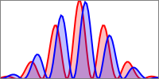

# Schrodinger Equation

## Free particle

$$
\psi(x, t) = \int_{-\infty}^\infty \frac{dp}{2\pi\hbar} e^{ipx/\hbar} e^{-\frac{i}{\hbar} \frac{p^2}{2m}t}
$${#eq:free-particle-evol}

## The Schrodinger Equation

Time independent Schrodinger equation:
$$
-\frac{\hbar^2}{2m} \partial_x^2\psi+V(x)\psi=E\psi
$$
in general:
$$
\hat{H}\psi = E\psi
$${#eq:ti-sch .squared-red}
$$
p = \hbar k
$$

$H$ is self-adjoint, $\exist \; \{\psi_E(x)\}$ complete:
$$
\psi(x) = \sum c_n \psi_n(x)
$$
but for de Broglie, each !!red{modo} frequency is $E_n/\hbar$:
$$
\Psi 
$$

Time dependent Schrodinger equation:
$$
i\hbar \frac{\partial}{\partial t} \psi = \hat{H} \psi
$${#eq:td-sch .squared-red}

## Tme evolution

!!sch equation, with $H$ in *abstract* form:
$$
i\hbar \partial_t \ket{\psi} = H \ket{\psi}
$${#eq:td-sch-ket}
and, in 1D:
$$
i\hbar \partial_t \psi(x, t) = H \psi(x, t)
$${#eq:td-sch-1d}
If we have 1P.:
$$
H = \frac{\mathbf{P}^2}{2m} + V
$$

#### Explicitly

Eigenvalues equations
$$
H f_n(x) = E_n f_n(x)
$$
then:
$$
\psi(\mathbf{x}, t) = \sum_n c_n(t) f_n(\mathbf{x})
$$
substituting in \eq_ref{eq:td-sch-1d} and solving:
$$
c_n(t) = c_n(0) e^{-iE_nt/\hbar}
$$
$$
\psi(\mathbf{x}, t) = \sum_n c_n e^{-iE_nt/\hbar} f_n(\mathbf{x})
$$

### *Time evolution* operator

$$
H \ket{n} = E_n \ket{n}
$${#eq:ti-eigenstates-sch .squared}

**Time evolution operator**:
$$
U(t) \equiv \exp(-i\hat{H}t/\hbar)
$${#eq:time-evol-operator .squared-red}
that is diagonal in the energy eigenstates:
$$
U(t) \ket{n} = e^{-iE_nt/\hbar} \ket{n}
$$
$$
\ket{\psi}_t \equiv U(t) \ket{\psi}
$${#eq:time-evol-usage}

It is an **unitary** operator:
$$
U^\dag = U^{-1}
$$
(because H is *self-adjoint*)

### Stationary states:

$$
H\psi(x) = E \psi(X)
$$
$$
\psi_E(\mathbf{x}, t) = \psi(\mathbf{x}, 0) \, e^{-iEt/\hbar}
$$
On this states, any observable is time-independent!:
$$
\braket{\psi_E(t) | A | \psi_E(t)} = \braket{\psi_E(0) | A | \psi_E(0)}
$$

## $H = H^\dag$ and conserved current

Using \eq_ref{eq:time-evol-usage}:
$$
\begin{split}
\partial_t \int d^3x |\psi(\mathbf{x}, t)|^2 &= 0 \\
\Longrightarrow ... = (\psi, H\psi) - (\psi, H^\dag\psi) &= 0
\end{split}
$$
so $H = H^\dag$, equivalently:
$$
\braket{\psi(t)\psi(t)} = \braket{\psi | U^\dag(t) U(t) | \psi} = \braket{\psi|\psi}
$$
that requires U *unitary* $\Longrightarrow$ H *self-adjoint*.

We define:
$$
\rho(\mathbf{x}, t) \equiv |\psi(\mathbf{x}, t)|
$$
from the conservation of $\rho$, we have the **continuity equation**:
$$
\partial_t \rho = -\text{div}\, \mathbf{j} = \nabla \cdot \mathbf{j} % wrong \;\;\text{where}\;\; \mathbf{j} = \nabla \rho
$$
that is the Gauss theorem, while in integral form:
$$
\partial_t \int_V \rho \, d^2x = -\oint_S d\mathbf{n} \cdot \mathbf{j}; \;\;\;\; S = \partial V
$$
and, by substitution,:
$$
\mathbf{j} = \frac{\hbar}{2mi} (\psi^*\bm{\nabla} \psi - (\bm{\nabla}\psi^*)\psi)
$${#eq:current .squared}
::: todo
rivedi perchè
:::

### Current conservation

::: todo
...
:::

## Heisenberg picture

$$
\braket{\alpha_t | A | \beta_t } = \braket{\alpha | e^{iHt\hbar} A e^{-iHt\hbar} | \beta }
$$
$$
A_H(t) = e^{iHt\hbar} A e^{-iHt\hbar}
$${#eq:heisenberg-obs-evol}
Derivating !!red{???}: 
$$
\frac{d}{dt} A_H = \frac{i}{\hbar} [H, A_H]
$${#eq:operator-derivative}
(only if A does not explicitly depends on t), generically:
$$
\frac{d}{dt} A_H = \frac{\partial}{\partial t}A_H + \frac{i}{\hbar} [H, A_H]
$${#eq:operator-derivative-full .squared-red}
where:
$$
\frac{\partial A_H}{\partial t} = e^{iHt\hbar} \frac{\partial A}{\partial t} e^{-iHt\hbar}
$$

## Hellmann-Feynman theorem

If $\psi(\lambda)$ is eigenstates relative to the eigenvalue $\lambda$:
$$
\frac{\partial E_n(\lambda)}{\partial\lambda} = \braket{\psi(\lambda) | \frac{\partial H(\lambda)}{\partial\lambda} | \psi(\lambda)}
$${#eq:hf-th .squared-red}
it is non trivial as $\psi$ also depends on $\lambda$

::: details example {open}
The simplest case is:
$$
H(\lambda) = H_0 + V(\lambda) \approx H_0 + \lambda V_0
$$
So:
$$
\partial_\lambda E_n = \braket{\psi_n | V_0 | \psi_n}
$$
$$
\delta E_n = \lambda \braket{\psi_n | V_0 | \psi_n} = \braket{\psi_n | V | \psi_n}
$${.squared-blue}
:::

::: todo
rivedi generalizzazione
:::

## Time dependant Hamiltonian

IF we take the !!sch equation with $H_S(t)$ ("$\cdot_s$" means *!!sch representation*), defining $\psi(t) = U(t, t0) \psi(t_0)$ $\forall \psi$:
$$
i\hbar \partial_t U(t, t_0) = H_S(t) U(t, t_0)\\
-i\hbar \partial_t U^\dag(t, t_0) = H_S(t) U^\dag(t, t_0)\\
T(t_0, t_0) = 1
$$
$$
U^{-1}(t, t_0) = U^\dag(t, t_0)
$$
Heisenberg:
$$
A_H(t) = U^\dag() A_S(t) U()
$${#eq:heisenberg-operator-evol}
Se scritta in funzione di $p$ e $q$, o di altri operatori, si mostra:
$$
A_H = A_S(p_H, q_H, t)
$$

$$
\frac{dA_H}{dt} = ... = \frac{i}{\hbar} [H_H(t), A_H(t)] + \frac{\partial A_H}{\partial t}
$${.squared}

### Properties

#### 1
$$
U(t_0, t_0) = 1
$$
$$
\partial_\lambda^{-1} = -U^{-1}(\partial_\lambda)U^{-1}
$$
::: todo
sbagliato?
:::
da cui:
$$
i\hbar\partial_t U^{-1} = -U^{-1} H(t)
$$

#### 2

$$
U(t_0, t) = U^{-1}(t, t_0)
$$

#### 3

$$
U(t, t_0) = U(t, t_1) U(t_1, t_0); \;\;\;\; \forall t_1
$$

## Time evolution, !!sch and Heisenberg pictures

$$
\ket{\psi_t} \equiv U(t)\ket{\psi}
$${#eq:evolved-psi-sch .squared-blue}

Heisemberg, see \eq_ref{eq:heisenberg-operator-evol}:
$$
A_h(t) = U^\dag(t) A U(t)
$$
An operator eigenvalues:
$$
A_H(t) = \ket{a_1;t} = a_1 \ket{a_1;t} \;\; \Longrightarrow \;\; \ket{a_1;t} = U^\dag(t)\ket{a_1}
$$
$$
\mathcal{A} = \braket{a_1;t | \psi_0}
$${.squared-red}

### Propagator

$$
K(q_1, t;q_0,t_0) = \braket{q_1, t|q_0, t_0}
$$
Two ways of computing it:
1. computing $U\ket{q_0}$: $K(q_1, t;q_0,0) = \braket{q_1| U(t, 0) |q_0}$
2. computing $Q_H(t)$ and finding the eigenvalue $q_1$

Knowing $K$ means knowing the evolution of any state:
$$
\psi_t(q) = \braket{q | U(t) | \psi} = \int_{q_1} = \braket{q | U(t) | q_1}\braket{q_1|\psi}\\
= \int_{q_1} K(q,t\;q_1,0) \psi(q_1)
$${.squared}

!!endspace